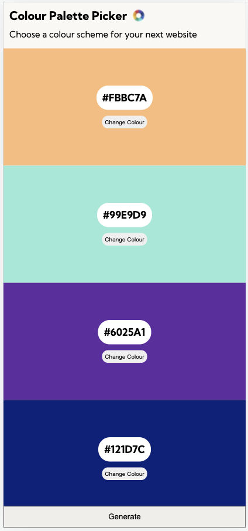
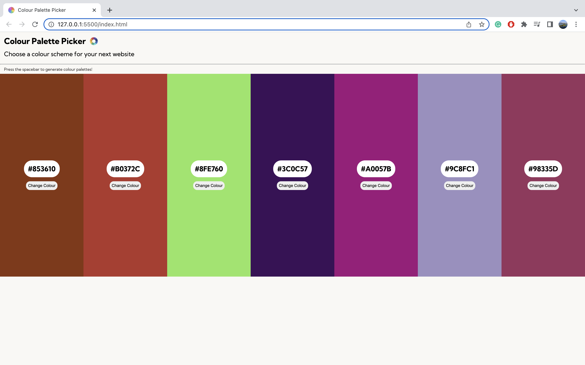

# Colour Palette Picker
## Pre Course Project for F&C 

You can find the hosted website [here!](https://joe-lindie.github.io/Colour-Palette-Picker/)

### **Features:** 
- Built with HTML, CSS & JS  ✓
- Code hosted on GitHub ✓
- Deployed to GitHub Pages ✓
- Auto-generate multiple colours ✓
- Allow users to change each colour ✓

### **Mobile Layout** 

### **Desktop Layout** 
